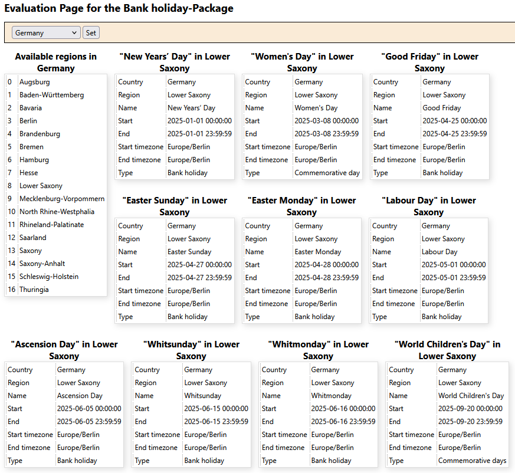

# Bank Holidays

The respository contains one PHP class per country. These classes contain the method getBankHolidays() which returns an array with the bank holidays.
If no argument is provided method getBankHolidays(), returns at least the bank holidays of the current year.

File `./www/index.php` can be used to play with the methods of classes *de* and *uk*.
You can install the www-project using composer: `composer create-project sourcepot/bankholidays {target dir}`
Just set your www-root directory to `{target dir}/src/www/`.

## How to use the PHP classes?

For bank holidays of the United Kongdom you can instantiate class uk as follows:

`require_once('../../vendor/autoload.php');`

`require_once('../php/uk.php');`

`$uk = new uk();`

`$bankHolidaysUK = $uk->getBankHolidays();`

$bankHolidaysUK will then return an associative array with the bank holidays of the past, current and next year (see the example below).
The keys of the associative array are: *array({country}=>array({eventId},...),...)* The sub-keys *{Event}* and *{Location/Destination}* are compatible with the Content of a Datapool calendar entry.
*{eventId}* can be used as *EntryId* of a Datapool calendar entry.

